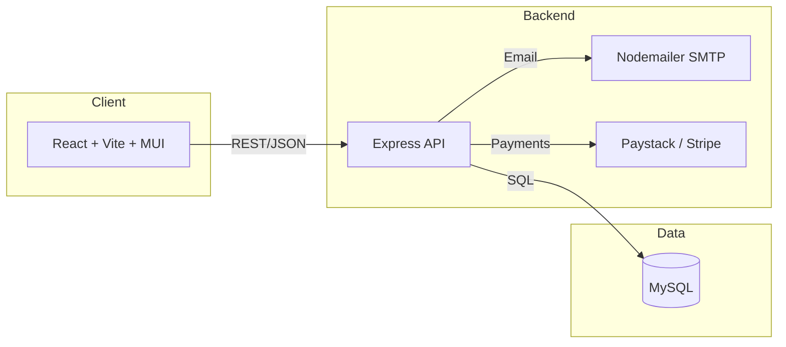
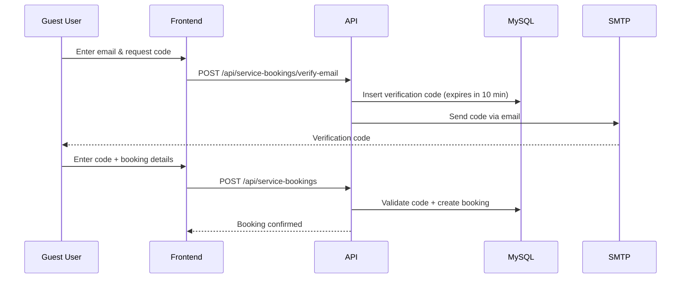
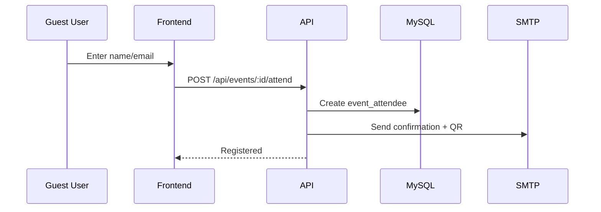
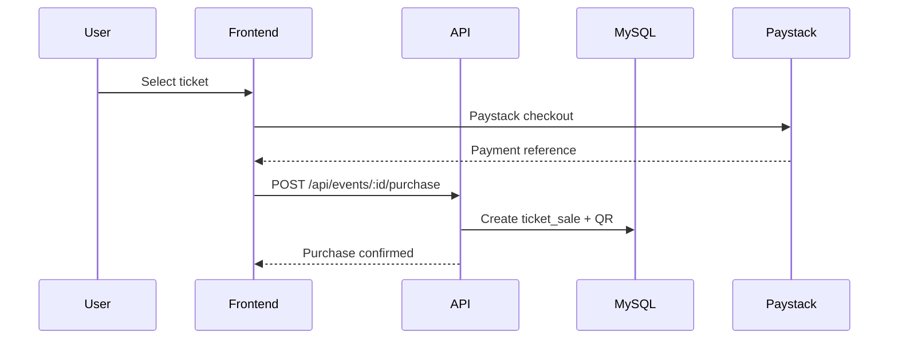

# System Design (Mermaid)

## High-Level Architecture

## Core Data Flows

### Guest Service Booking (Email Verification)

### Public Event Registration

### Ticket Purchase (Authenticated)

## Key Components

- **Frontend**: React + Vite + MUI
- **Backend**: Express API with JWT auth
- **DB**: MySQL for events, services, bookings, tickets, messaging
- **Email**: SMTP via Nodemailer
- **Payments**: Paystack (primary), optional Stripe

## Core Tables (summary)

- `users`
- `events`
- `services`
- `service_bookings`
- `guest_booking_verifications`
- `tickets`
- `ticket_sales`
- `event_attendees`
- `messages`
- `payout_requests`
- `vendor_availability_blocks`

---

If you'd like, I can expand this into a full architecture document with deployment topology and scaling plans.
